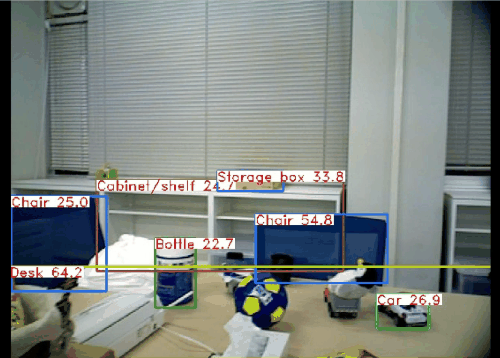

<!----------------------------------------------------------------------------------------------------------------------
#
#   Title
#
# --------------------------------------------------------------------------------------------------------------------->
# YOLO V5 ROS

<!----------------------------------------------------------------------------------------------------------------------
#
#   Badge
#
# --------------------------------------------------------------------------------------------------------------------->
[](https://gitlab.com/nenecchi-ws/ros/packages/yolov5-ros/-/commits/main)
[](https://github.com/psf/black)
[](https://www.gnu.org/licenses/gpl-3.0)

<!----------------------------------------------------------------------------------------------------------------------
#
#   Description
#
# --------------------------------------------------------------------------------------------------------------------->
This is a ROS wrapper of [YOLO V5](https://github.com/ultralytics/yolov5) for Object Detection from compressed image.



<!----------------------------------------------------------------------------------------------------------------------
#
#   Table of Contents
#
# --------------------------------------------------------------------------------------------------------------------->
## Table of Contents
  * [Requirement](#requirement)
  * [Getting Started](#getting-started)
  * [Example](#example)
  * [ROS API](#ros-api)
  * [Contributing](#contributing)
  * [License](#license)
<!----------------------------------------------------------------------------------------------------------------------
#
#   Requirement
#
# --------------------------------------------------------------------------------------------------------------------->
## Requirement
* Required
  * Ubuntu 20.04
  * Python 3.8
  * ROS Noetic
* Recommends
  * CUDA >= 11.3

<!----------------------------------------------------------------------------------------------------------------------
#
#   Dependencies
#
# --------------------------------------------------------------------------------------------------------------------->
## Dependencies
Code wrapped from https://github.com/ultralytics/yolov5

URL: https://github.com/ultralytics/yolov5
Tag: `v6.2`  
Commit: `d3ea0df8b9f923685ce5f2555c303b8eddbf83fd`  
Original README.md: https://github.com/ultralytics/yolov5/blob/v6.2/README.md  
Original LICENSE: https://github.com/ultralytics/yolov5/blob/v6.2/LICENSE  

<!----------------------------------------------------------------------------------------------------------------------
#
#   Weights
#
# --------------------------------------------------------------------------------------------------------------------->
## Weights
Get network weights by the shell. (`yolov5m.pt` and `yolov5m_Objects365.pt`)  
Other weights: https://github.com/ultralytics/yolov5/releases/tag/v6.2

```shell
roscd yolov5_ros/weights
bash download.sh
```

<!----------------------------------------------------------------------------------------------------------------------
#
#   Example
#
# --------------------------------------------------------------------------------------------------------------------->
## Example
weight: `yolov5m.pt`
```shell
roslaunch yolov5_ros yolov5.launch rviz:=true
```

weight: `yolov5m_Objects365.pt`
```shell
roslaunch yolov5_ros yolov5_objects365.launch rviz:=true
```

<!----------------------------------------------------------------------------------------------------------------------
#
#   ROS API
#
# --------------------------------------------------------------------------------------------------------------------->
## ROS API
### Yolo V5 Node

#### Subscribed Topics
* `/input/image/compressed` (sensor_msgs/CompressedImage)

#### Published Topics
* `/output/bboxes` (yolov5_ros_msgs/BoundingBoxes)
* `/output/image/compressed` (sensor_msgs/CompressedImage)

#### Action Subscribed Namespace
* `/action/detection` (yolov5_ros_msgs/DetectionAction)

#### Service
* `/service/detection` (yolov5_ros_msgs/Detection)

#### Parameters
* `~score_threshold` (double, default=0.2)
* `~iou_threshold` (double, default=0.45)
* `~encoding` (str, default="rgb8")
* `~device` (str, default="cuda")

<!----------------------------------------------------------------------------------------------------------------------
#
#   Contributing
#
# --------------------------------------------------------------------------------------------------------------------->
## Contributing
See [CONTRIBUTING](CONTRIBUTING.md) to learn about CI.

<!----------------------------------------------------------------------------------------------------------------------
#
#   License
#
# --------------------------------------------------------------------------------------------------------------------->
## License
GPL-3.0 License (see [LICENSE](LICENSE)).  
Original LICENSE: https://github.com/ultralytics/yolov5/blob/v6.2/LICENSE  
